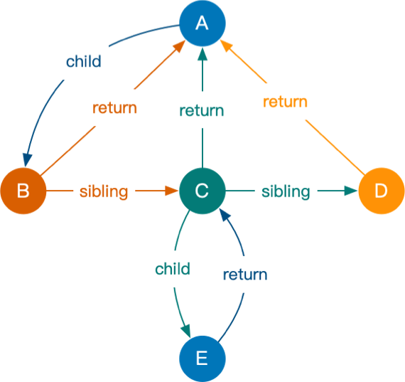

# mini-react实现

通过理解并实现React中的基本概念`虚拟DOM/JSX`,`Fiber`,`函数组件`及核心方法`useState`,`useEffect`，来掌握React的函数组件到页面渲染更新的基本过程。

---

##### 基本概念

1. 虚拟DOM ｜ JSX
   - JSX只是一个语法扩展，其核心无非是 **`React.createElement(type, prop, children)`**
   - 虚拟DOM是对真实DOM描述的一种数据结构，将数据和DOM结构相关联起来，并且在SPA中相对精准的操作DOM
2. Fiber
   - 概念: 将渲染工作`分割成块`,`可中断`,可根据`优先级`执行任务
   - API: [requestIdleCallback](https://developer.mozilla.org/zh-CN/docs/Web/API/Window/requestIdleCallback) (兼容及行为不一致原因,react内部自己实现)
        >   window.requestIdleCallback() 方法插入一个函数，这个函数将在浏览器空闲时期被调用。这使开发者能够在主事件循环上执行后台和低优先级工作，而不会影响延迟关键事件，如动画和输入响应。函数一般会按先进先调用的顺序执行，然而，如果回调函数指定了执行超时时间timeout，则有可能为了在超时前执行函数而打乱执行顺序。
   - 数据结构: **链表** 
   - 创建的基本流程
     1. performWorkOfUnit方法,从根节点开始，向下采取深度优先遍历
     2. 到达叶子结点后(无法继续向下),回头向上找到未遍历的结点(当前叶子的父节点的兄弟节点)
   - 更新的基本流程
     1. 双缓存: 同时存在两个fiber树(current Fiber树和workInProgress树)
     2. 当每次reconcile时,会创建一颗新的workInProgress树，新旧fiber结点通过alternate指针相连
     3. diff(只实现了最简单的对比):通过alternate指针对比新老结点来决定复用/删除/创建结点
   - 统一提交
        1. 收集创建/更新/删除，在commit阶段一次性提交
        2. commit阶段的也是利用fiber的结构进行更新DOM
3. 函数组件
    - 实质: React.createElement 转换后 type为function, 直接执行传入props
    - 问题: 函数组件会占用一个层级，在处理fiber的时候需要多找一下他的children,sibling,return关系

---

##### 核心函数

1. useState
    - 调用useState

        ```js
        const currentFiber = wipFiber
        const oldHook = currentFiber.alternate?.stateHooks[stateHooksIndex]

        const stateHook = {
            state: oldHook ? oldHook.state : initial,
            queue: oldHook ? oldHook.queue : []
        }
        stateHook.queue.forEach((action) => {
            stateHook.state = action(stateHook.state)
        })
        stateHook.queue = []

        stateHooksIndex++
        stateHooks.push(stateHook)

        currentFiber.stateHooks = stateHooks
        ```

        1. 在当前的fiber上创建一个stateHooks,保存多个hooks的数据
        2. 通过全局hookIndex获取对应stateHook,每个stateHook内部保存state初始化数据(如果存在老的stateHook,获取老的stateHook上的state)
        3. 将生成一个队列保存后续setState的action,在下次useState的时候执行所有的setState的action，在给stateHook的state赋值

    - 调用setState

        ```js
            const setState = (action) => {

            const eagerState = typeof action === 'function' ? action(stateHook.state) : () => action

            if (eagerState === stateHook.state) {
                return
            }
            stateHook.queue.push(typeof action === 'function' ? action : () => action)

            wipRoot = {
                ...currentFiber,
                alternate: currentFiber
            }
            nextWorkOfUnit = wipRoot
        }
        ```

        1. 调用setState的action,获取结果,如果值和原来的值不一样,则将action推入stateHook的queue
        2. **将当前的fiber丢给下一次执行的nextWorkOfUnit**,后续空闲时就会更新当前fiber,则会重新执行useState并执行stateHook中的queue,从而更新state

2. useEffect
    - 调用useEffect
    - 监控依赖
    - cleanup
    - 更新
